# Pico-HSM Java PoC

Proof of Concept de integração entre aplicações Java e um HSM executado em **Raspberry Pi Pico RP2040**, utilizando **Pico-HSM, OpenSC e PKCS#11**.

O objetivo do repositório é validar diferentes estratégias de uso de chaves criptográficas armazenadas em hardware externo, com foco em cenários que possam servir de laboratório para uma futura integração com um HSM corporativo real.

> **Importante:** o Raspberry Pi Pico RP2040 com Pico-HSM é utilizado neste projeto como ambiente de laboratório. Ele não substitui um HSM corporativo certificado e não oferece necessariamente as mesmas garantias de segurança física, disponibilidade, gerenciamento de chaves ou certificações.

---

## Implementações

O projeto possui atualmente duas provas de conceito.

### 1. Assinatura assimétrica com `SHA512withRSA`

A primeira implementação demonstra o uso de uma chave privada RSA não exportável armazenada no Pico-HSM para realizar uma assinatura digital.

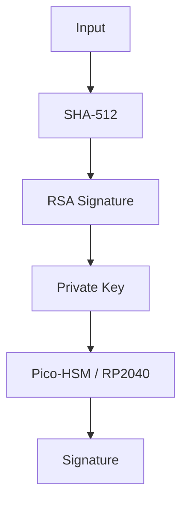

A assinatura é posteriormente validada utilizando a chave pública correspondente.

Essa PoC valida principalmente:

* Java + SunPKCS11;
* OpenSC;
* acesso ao Pico-HSM;
* chave RSA não exportável;
* assinatura assimétrica;
* `SHA512withRSA`;
* validação positiva e negativa de assinatura.

**Documentação completa:**

[docs/Main.md](docs/Main.md)

---

### 2. Password matching com PBKDF2 + RSA-OAEP

A segunda implementação evolui a PoC para um cenário mais próximo de validação de senha protegida por HSM.

A senha não é criptografada diretamente.

Primeiro é produzido um verifier utilizando:

* `PBKDF2WithHmacSHA256`;
* salt aleatório;
* fator de custo configurado pela aplicação.

Depois esse verifier é protegido utilizando **RSA-OAEP**.

#### Geração do verifier protegido

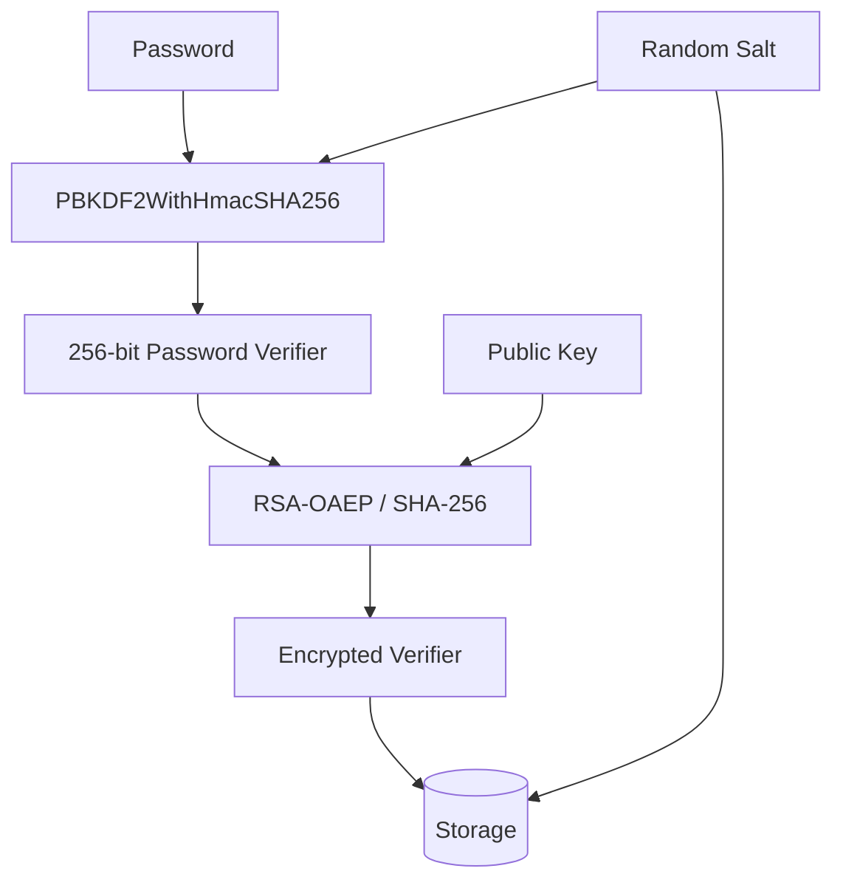

São armazenados, conceitualmente:

* algoritmo;
* número de iterações;
* salt;
* verifier criptografado;
* identificação da chave utilizada.

#### Password match

Durante a autenticação, a senha candidata é submetida novamente ao PBKDF2.

Ao mesmo tempo, o verifier armazenado é decriptado através do Pico-HSM.

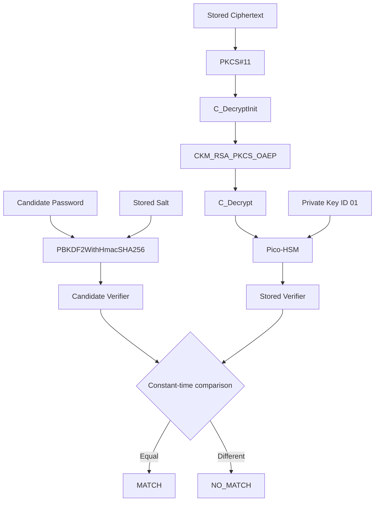

Essa PoC valida principalmente:

* PBKDF2 para derivação de verifier;
* RSA-OAEP;
* acesso direto ao PKCS#11;
* `C_Login`;
* `C_FindObjects`;
* `C_DecryptInit`;
* `C_Decrypt`;
* chave privada RSA não exportável;
* password matching dependente do HSM;
* resultado `MATCH` / `NO_MATCH`.

**Documentação completa:**

[docs/MainPasswordCrypt.md](docs/MainPasswordCrypt.md)

---

## Estrutura do repositório

```text
pico-hsm-poc/
│
├── README.md
│
├── pkcs11.cfg
│
├── src/
│   ├── Main.java
│   └── MainPasswordCrypt.java
│
├── docs/
│   ├── Main.md
│   └── MainPasswordCrypt.md
│
└── keys/
    ├── cert01.pem
    ├── chavepublicadodevice.pem
    └── ...
```

---

## Arquitetura geral

As duas implementações compartilham a mesma infraestrutura básica.

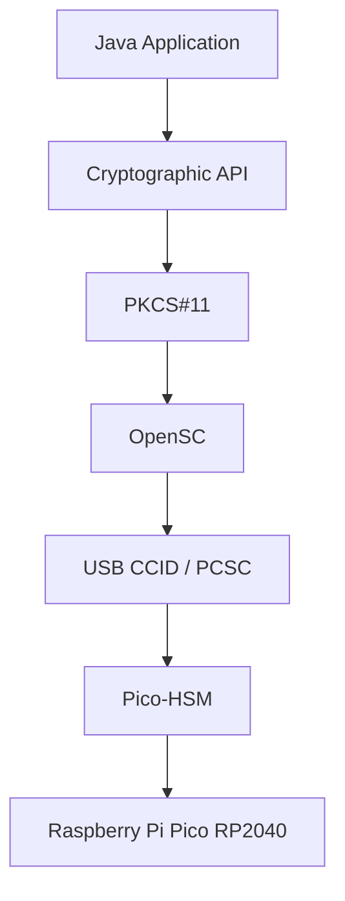

O **PKCS#11** é a principal abstração utilizada entre a aplicação e o dispositivo criptográfico.

Isso permite que o laboratório utilize:


enquanto um cenário corporativo pode evoluir para:


---

## Arquitetura da PoC de assinatura

A implementação `Main.java` utiliza o `SunPKCS11` como integração entre JCA/JCE e o token.

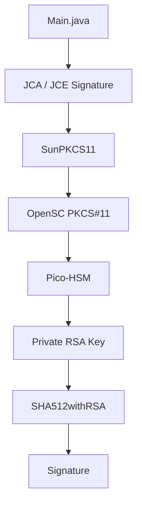

Nesse cenário, o provider `SunPKCS11-PicoHSM` expôs corretamente operações do tipo `Signature`, incluindo:

* `SHA256withRSA`;
* `SHA384withRSA`;
* `SHA512withRSA`;
* `RSASSA-PSS`;
* ECDSA.

---

## Arquitetura da PoC de password matching

Durante os testes foi identificado que o provider `SunPKCS11-PicoHSM` não expunha operações JCE do tipo `Cipher`, apesar de o dispositivo anunciar mecanismos RSA de decrypt via PKCS#11.

Por esse motivo, `MainPasswordCrypt.java` utiliza acesso direto às operações PKCS#11.

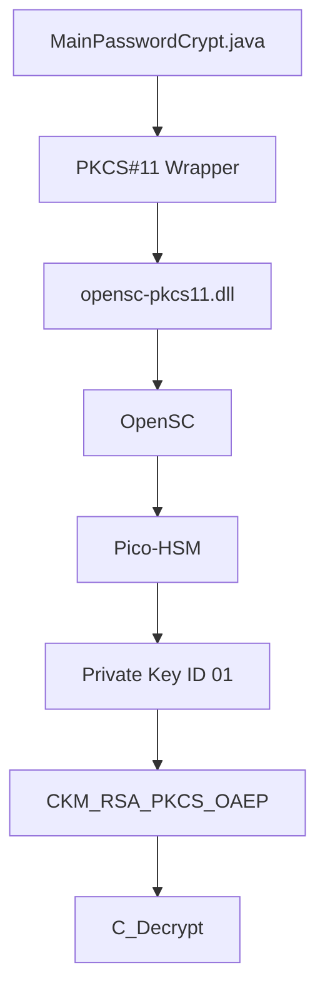

O fluxo executado é equivalente a:

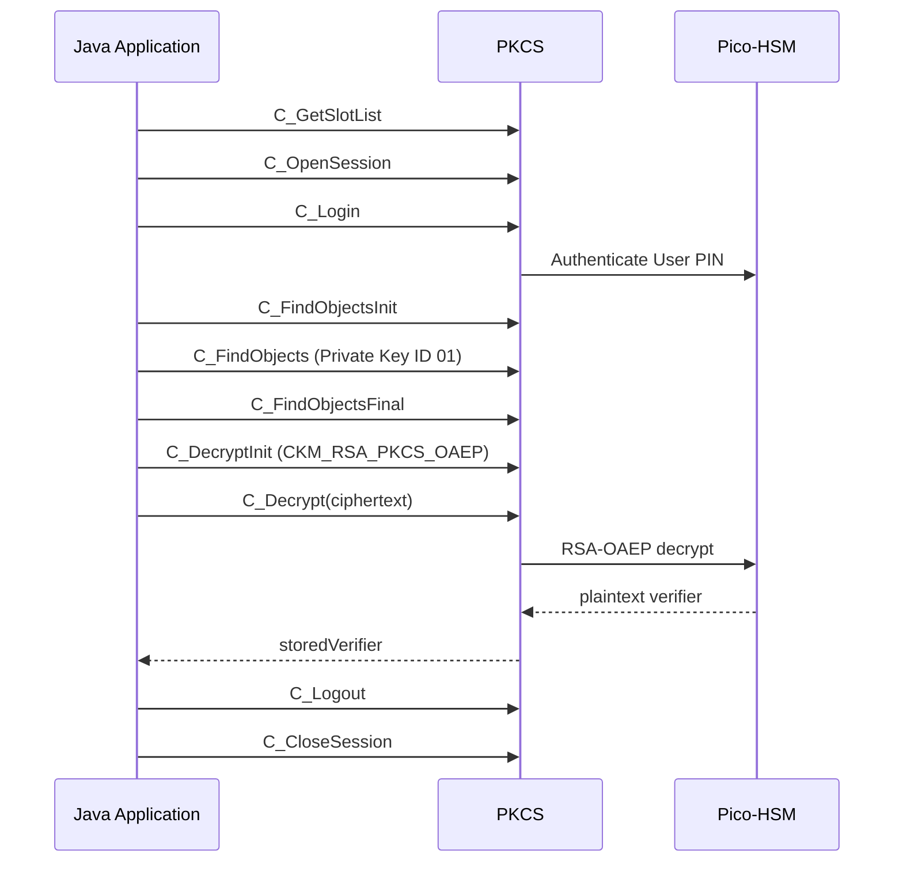

---

## Propriedade da chave privada

Uma das propriedades centrais da PoC é que a chave privada RSA é criada dentro do Pico-HSM.

O objeto PKCS#11 apresentou:

```text
Access:
    sensitive
    always sensitive
    never extractable
    local
```

Conceitualmente:

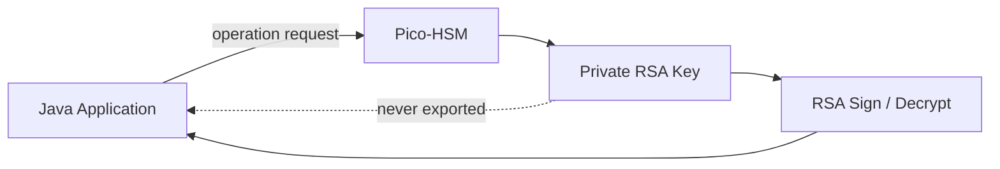

A aplicação solicita operações criptográficas, mas não recebe os bytes da chave privada.

---

## Comparação entre as PoCs

| Característica          | `Main.java`             | `MainPasswordCrypt.java`       |
| ----------------------- | ----------------------- | ------------------------------ |
| Objetivo                | Assinatura digital      | Password matching              |
| Operação principal      | Sign / Verify           | Encrypt / Decrypt / Match      |
| RSA                     | Sim                     | Sim                            |
| SHA-512                 | Sim                     | Não diretamente no fluxo final |
| PBKDF2                  | Não                     | Sim                            |
| RSA-OAEP                | Não                     | Sim                            |
| SunPKCS11               | Sim                     | Parcialmente substituído       |
| PKCS#11 direto          | Não                     | Sim                            |
| Private Key no HSM      | Sim                     | Sim                            |
| Private Key exportável  | Não                     | Não                            |
| HSM necessário no match | Não                     | Sim                            |
| Resultado               | Signature valid/invalid | MATCH / NO_MATCH               |

---

## Evolução das implementações

O projeto começou validando assinatura assimétrica:


Essa abordagem comprovou com sucesso:

* conectividade;
* PKCS#11;
* chave privada não exportável;
* uso de hardware;
* integração Java.

Entretanto, a verificação da assinatura utiliza apenas a chave pública.

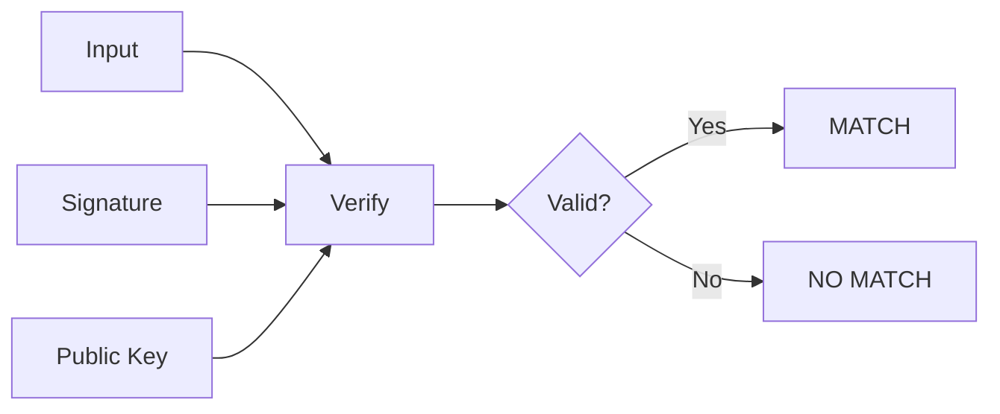

Portanto, o HSM não é necessário para realizar o match.

A segunda PoC altera essa propriedade.

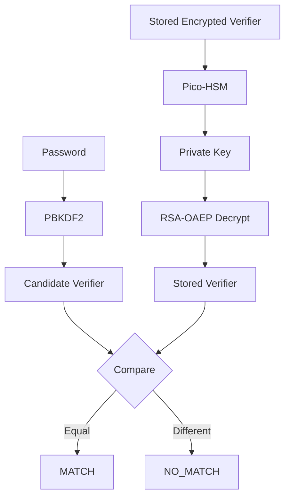

Agora a operação privada do HSM faz parte do processo de autenticação.

---

## Status

| Implementação                                | Status     |
| -------------------------------------------- | ---------- |
| `Main.java` — assinatura RSA                 | ✅ Validada |
| `MainPasswordCrypt.java` — password matching | ✅ Validada |
| OpenSC + Pico-HSM                            | ✅ Validado |
| Java → PKCS#11                               | ✅ Validado |
| RSA-OAEP via PKCS#11                         | ✅ Validado |
| MATCH com senha correta                      | ✅ Validado |
| NO_MATCH com senha incorreta                 | ✅ Validado |

---

## Objetivo final

O objetivo dessas provas de conceito não é transformar o Raspberry Pi Pico em um substituto de um HSM corporativo.

O objetivo é validar antecipadamente componentes arquiteturais importantes:

* comunicação Java ↔ HSM;
* PKCS#11;
* autenticação no token;
* gerenciamento de chaves;
* geração de chaves no hardware;
* chaves privadas não exportáveis;
* assinatura assimétrica;
* RSA decrypt;
* RSA-OAEP;
* password verifier;
* password matching dependente de hardware.

A estratégia é permitir futuramente esta evolução:

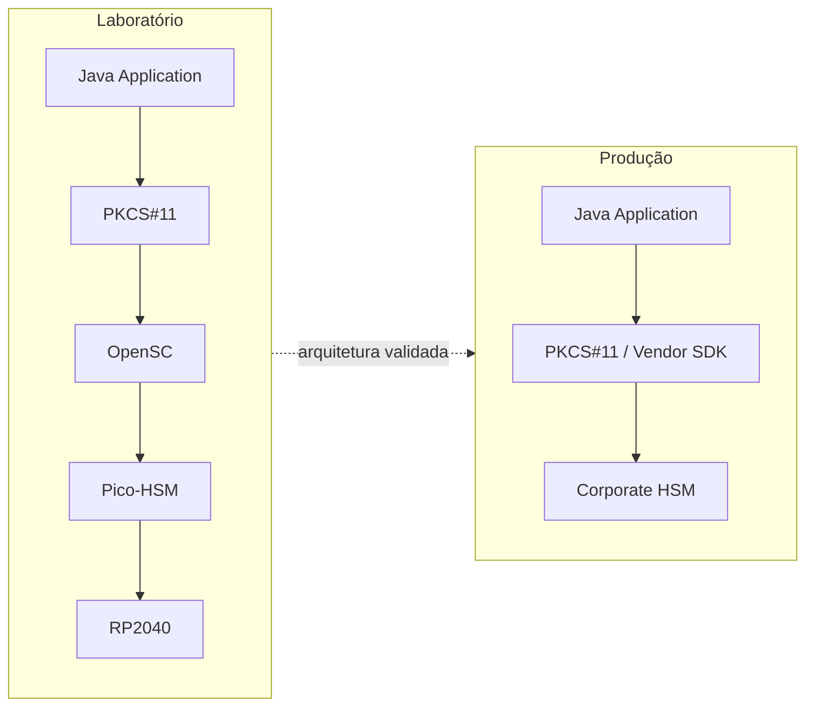

A camada específica do dispositivo deve idealmente permanecer isolada da regra de negócio da aplicação.

---

## Documentação

### Assinatura assimétrica

[docs/Main.md](docs/Main.md)

Demonstra:

```text
SHA512withRSA
+
SunPKCS11
+
Private Key no Pico-HSM
```

### Password matching

[docs/MainPasswordCrypt.md](docs/MainPasswordCrypt.md)

Demonstra:

```text
PBKDF2WithHmacSHA256
+
RSA-OAEP
+
PKCS#11 direto
+
Private Key no Pico-HSM
+
MATCH / NO_MATCH
```

---

## Aviso

Este projeto é destinado a:

* laboratório;
* estudo;
* validação arquitetural;
* testes de integração;
* provas de conceito.

Antes de qualquer uso em produção devem ser avaliados:

* threat modeling;
* política corporativa de criptografia;
* parâmetros de password hashing;
* gerenciamento de PIN e credenciais;
* proteção contra ataques de memória;
* gestão e rotação de chaves;
* mecanismos de backup;
* disponibilidade do HSM;
* auditoria;
* integração com secret management;
* hardening;
* SDK e mecanismos oficialmente suportados pelo fabricante do HSM;
* requisitos regulatórios e de compliance.

O **Pico-HSM sobre Raspberry Pi Pico RP2040 deve ser tratado como plataforma de laboratório**, e não como equivalente de segurança de um HSM corporativo.

---

## Resultado

As duas PoCs demonstram com sucesso dois modelos distintos de interação com hardware criptográfico:

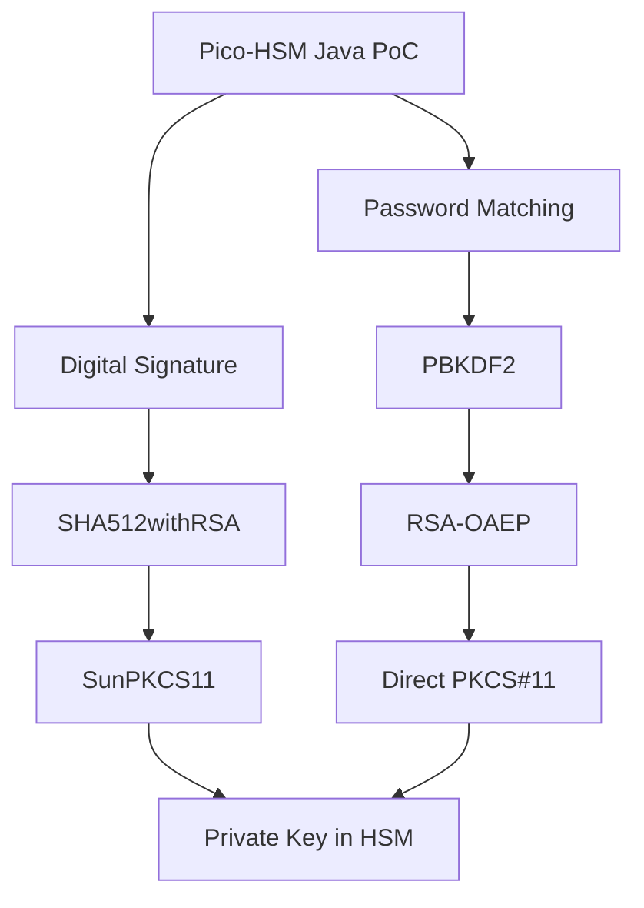

**Status geral: PoC validada com sucesso.**

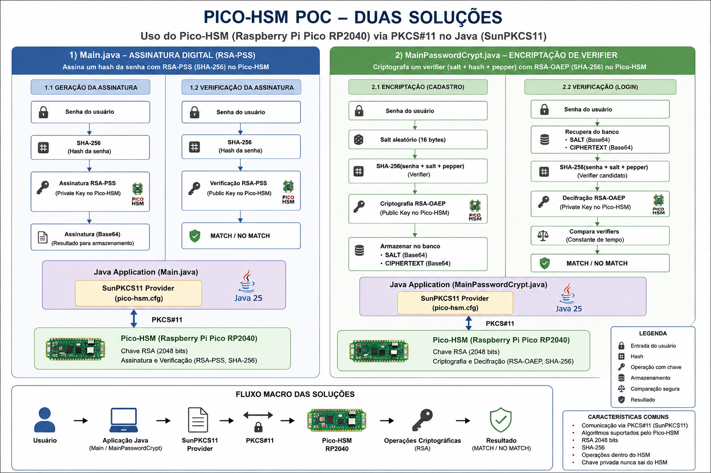

